# 🎛️ feature/prompt-platform

| Branch                    | Parent                                            | Goal                                             | Main Result                                              | Glam Makeup    | Prompt Translator | Face Masks      | Remove Objects        | AI Enhancer | Upscale         | Assets           | Back                                                                                  |
| ------------------------- | ------------------------------------------------- | ------------------------------------------------ | -------------------------------------------------------- | -------------- | ----------------- | --------------- | --------------------- | ----------- | --------------- | ---------------- | ------------------------------------------------------------------------------------- |
| `feature/prompt-platform` | after Remove Objects / Templates / Tools branches | create shared platform for prompt-driven editing | modular runners + local face editing + organized scripts | local pipeline | Qwen              | MediaPipe masks | auto + manual cleanup | preserved   | local/tool flow | 30 README images | [Main README](https://github.com/amanzhola/mobile-assets-backend/blob/main/README.md) |

---

## 🌳 Project structure

```text
mobile-assets-backend/
├── CMakeLists.txt
├── README.md
├── conanfile.txt
├── data/
│   ├── onboarding.json
│   ├── templates.json
│   └── tools.json
├── models/
│   ├── local/
│   │   └── sam_vit_b_01ec64.pth
│   └── mediapipe/
│       └── face_landmarker.task
├── readme_assets/
│   ├── ai_enhancer/
│   │   ├── ai_enhancer_1.png
│   │   ├── ai_enhancer_2.png
│   │   ├── input.jpg
│   │   └── upscale.png
│   ├── glam_makeup/
│   │   ├── blue_lips.png
│   │   ├── evening_glam.png
│   │   ├── green_brows.png
│   │   ├── green_eyes.png
│   │   ├── input.jpg
│   │   ├── smile_level_3.png
│   │   └── soft_pink_blush.png
│   ├── remove_background/
│   │   ├── input.jpg
│   │   ├── transparent.png
│   │   └── white_background.png
│   ├── remove_objects/
│   │   ├── auto_remove.png
│   │   ├── input.jpg
│   │   └── manual_cleanup.png
│   ├── showcase/
│   │   ├── black_eyes.png
│   │   ├── evening_glam_1.png
│   │   ├── evening_glam_2.png
│   │   ├── evening_glam_3.png
│   │   ├── ghibli.png
│   │   ├── green_eyes.png
│   │   ├── green_lips.png
│   │   ├── input.jpg
│   │   ├── red_lips.png
│   │   ├── remove_background.png
│   │   └── smile_level_3.png
│   └── skin_clean/
│       ├── input.png
│       └── output.png
├── scripts/
│   ├── background/
│   │   └── remove_background.py
│   ├── common/
│   │   └── convert_image_to_png.py
│   ├── face/
│   │   ├── makeup/
│   │   │   ├── __init__.py
│   │   │   ├── apply_face_makeup.py
│   │   │   └── renderers/
│   │   │       ├── __init__.py
│   │   │       ├── brow_renderer.py
│   │   │       ├── cheek_renderer.py
│   │   │       ├── common.py
│   │   │       ├── eye_renderer.py
│   │   │       └── lip_renderer.py
│   │   ├── masks/
│   │   │   └── create_face_region_mask.py
│   │   └── unused/
│   │       └── apply_glam_makeup_overlay.py
│   ├── generation/
│   │   └── create_prompt_collage.py
│   ├── objects/
│   │   ├── auto/
│   │   │   └── create_object_mask_sam.py
│   │   ├── common/
│   │   │   └── apply_inpaint_mask.py
│   │   └── manual/
│   │       └── prepare_manual_cleanup_mask.py
│   ├── unused/
│   │   ├── create_object_mask.py
│   │   └── remove_objects.py
│   └── upscale/
│       └── upscale_image.py
├── src/
│   ├── action_runners/
│   │   ├── ai_enhancer_runner.cpp
│   │   ├── ai_enhancer_runner.h
│   │   ├── glam_makeup_runner.cpp
│   │   ├── glam_makeup_runner.h
│   │   ├── prompt_runner.cpp
│   │   ├── prompt_runner.h
│   │   ├── remove_background_runner.cpp
│   │   ├── remove_background_runner.h
│   │   ├── remove_objects_cleanup_runner.cpp
│   │   ├── remove_objects_cleanup_runner.h
│   │   ├── remove_objects_mask_runner.cpp
│   │   ├── remove_objects_mask_runner.h
│   │   ├── remove_objects_runner.cpp
│   │   ├── remove_objects_runner.h
│   │   ├── skin_improve_runner.cpp
│   │   ├── skin_improve_runner.h
│   │   ├── smile_edit_runner.cpp
│   │   ├── smile_edit_runner.h
│   │   ├── template_runner.cpp
│   │   ├── template_runner.h
│   │   ├── tool_action_runner.cpp
│   │   ├── tool_action_runner.h
│   │   ├── upscale_runner.cpp
│   │   └── upscale_runner.h
│   ├── comfy/
│   │   ├── comfy_client.cpp
│   │   ├── comfy_client.h
│   │   ├── workflow_builder.cpp
│   │   └── workflow_builder.h
│   ├── face_edit/
│   │   ├── face_edit_plan.cpp
│   │   ├── face_edit_plan.h
│   │   ├── face_editor.cpp
│   │   ├── face_editor.h
│   │   ├── face_masks.cpp
│   │   ├── face_masks.h
│   │   ├── face_parser.cpp
│   │   ├── face_parser.h
│   │   ├── face_regions.cpp
│   │   └── face_regions.h
│   ├── generation/
│   │   ├── generation_action_router.cpp
│   │   ├── generation_action_router.h
│   │   ├── generation_json.cpp
│   │   ├── generation_json.h
│   │   ├── generation_task_store.cpp
│   │   ├── generation_task_store.h
│   │   ├── generation_tool_prompts.cpp
│   │   └── generation_tool_prompts.h
│   ├── prompt/
│   │   ├── prompt_builder.cpp
│   │   ├── prompt_builder.h
│   │   ├── prompt_normalizer.cpp
│   │   ├── prompt_normalizer.h
│   │   ├── prompt_templates.cpp
│   │   ├── prompt_templates.h
│   │   ├── prompt_translator.cpp
│   │   └── prompt_translator.h
│   ├── api_handler.cpp
│   ├── api_handler.h
│   ├── catalog_service.cpp
│   ├── catalog_service.h
│   ├── generation_service.cpp
│   ├── generation_service.h
│   ├── http_server.cpp
│   ├── http_server.h
│   ├── main.cpp
│   ├── output_service.cpp
│   ├── output_service.h
│   ├── template_asset_service.cpp
│   ├── template_asset_service.h
│   ├── upload_service.cpp
│   └── upload_service.h
├── storage/
│   ├── input/
│   ├── output/
│   ├── template_cache/
│   ├── tasks.backup.json
│   └── tasks.json
├── tools/
│   └── realesrgan-ncnn-vulkan/
└── workflows/
    ├── ai_enhancer.json
    ├── remove_objects_cleanup_inpaint.json
    ├── remove_objects_inpaint.json
    ├── smile_edit_liveportrait.json
    ├── template_img2img.json
    └── tool_img2img.json
```

---

## ✅ What changed

| #  | Area               | Before                          | After                                | Result                           |
| -- | ------------------ | ------------------------------- | ------------------------------------ | -------------------------------- |
| 1  | Prompt platform    | direct action logic was mixed   | action runners + prompt modules      | cleaner architecture             |
| 2  | Glam Makeup        | mostly ComfyUI / SDXL           | local face editing pipeline          | stable face-preserving makeup    |
| 3  | Prompt translation | manual `RU_TO_EN` dictionary    | Qwen translation                     | better multilingual prompts      |
| 4  | Face masks         | no stable region masks          | `FaceMasks` + MediaPipe face regions | local makeup by exact area       |
| 5  | Python scripts     | flat `scripts/` folder          | grouped by domain                    | easier maintenance               |
| 6  | Makeup renderers   | one big script idea             | per-region renderers                 | lips/cheeks/eyes/brows separated |
| 7  | Remove Objects     | auto + manual cleanup preserved | organized script paths               | cleaner Remove Objects pipeline  |
| 8  | Upscale            | moved to `scripts/upscale/`     | local upscale script location        | clearer tool domain              |
| 9  | README assets      | scattered examples              | organized showcase assets            | visual documentation             |
| 10 | Generation service | still central but lighter       | runners/helpers used                 | platform direction established   |

---

## 💄 Glam Makeup handover

| Item              | Old behavior                   | New behavior                                             |
| ----------------- | ------------------------------ | -------------------------------------------------------- |
| Main route        | prompt → Comfy workflow → SDXL | prompt → Qwen → Face Parser → Face Mask → local renderer |
| Face preservation | unstable                       | strong                                                   |
| Lipstick          | partial / unpredictable        | local lips renderer                                      |
| Blush             | could appear anywhere          | local cheeks renderer                                    |
| Eye color         | unpredictable                  | local iris/eyes renderer                                 |
| Eyelids           | SDXL guessed                   | local eyelids support                                    |
| Eyebrows          | not supported                  | local eyebrows support                                   |
| Speed             | slow when SDXL used            | fast local processing for supported regions              |
| Identity          | could change                   | preserved for local edits                                |

---

## 🧠 New Glam Makeup architecture

| Layer                 | Responsibility                                           | Files                                           |
| --------------------- | -------------------------------------------------------- | ----------------------------------------------- |
| Prompt Translator     | converts user prompt to English / normalized instruction | `src/prompt/prompt_translator.*`                |
| Face Parser           | detects target face region from text                     | `src/face_edit/face_parser.cpp`                 |
| Face Regions          | enum/string mapping for editable regions                 | `src/face_edit/face_regions.*`                  |
| Face Masks            | calls Python mask generator                              | `src/face_edit/face_masks.*`                    |
| Python Mask Generator | creates RGBA mask for selected face area                 | `scripts/face/masks/create_face_region_mask.py` |
| Makeup Router         | routes region to correct renderer                        | `scripts/face/makeup/apply_face_makeup.py`      |
| Renderers             | apply local color/blend effect                           | `scripts/face/makeup/renderers/*.py`            |
| Runner                | orchestrates local vs Comfy fallback                     | `src/action_runners/glam_makeup_runner.*`       |

---

## 🎨 Supported local makeup regions

| Region       | Status           | Renderer / Logic                 | Notes                          |
| ------------ | ---------------- | -------------------------------- | ------------------------------ |
| lips         | ✅                | `lip_renderer.py`                | upper + lower lips fixed       |
| cheeks       | ✅                | `cheek_renderer.py`              | soft ellipse + blur            |
| eyes         | ✅                | `eye_renderer.py`                | iris color changes             |
| eyelids      | ✅                | eye/eyelid logic                 | eyeshadow support              |
| eyebrows     | ✅                | `brow_renderer.py`               | new region                     |
| skin         | partial/fallback | local or Comfy depending request | complex retouch can need model |
| face         | fallback         | Comfy when broad style requested | full style generation          |
| face contour | fallback         | future local support             | not core in this branch        |

---

## 🧩 Python package structure

| File / Folder                               | Why it exists                     |
| ------------------------------------------- | --------------------------------- |
| `scripts/face/makeup/__init__.py`           | marks makeup as Python package    |
| `scripts/face/makeup/renderers/__init__.py` | marks renderers as Python package |
| `renderers/common.py`                       | shared blending/color helpers     |
| `lip_renderer.py`                           | lip color and lipstick effects    |
| `cheek_renderer.py`                         | blush rendering                   |
| `eye_renderer.py`                           | iris/eye coloring                 |
| `brow_renderer.py`                          | eyebrow coloring                  |

---

## 🗣️ Prompt Translator

| Before                       | After                         |
| ---------------------------- | ----------------------------- |
| manual `RU_TO_EN` dictionary | Qwen-based translation        |
| limited phrases              | flexible natural prompts      |
| fragile mapping              | better region/color detection |

| Example input             | Translated / normalized meaning |
| ------------------------- | ------------------------------- |
| `зелёные брови`           | `Green eyebrows`                |
| `синий карандаш для глаз` | `Blue eyeliner`                 |
| `фиолетовая помада`       | `Purple lipstick`               |
| `мягкие розовые румяна`   | `Soft pink blush`               |

---

## 🧴 Local Makeup technology

| Technology       | Purpose                                |
| ---------------- | -------------------------------------- |
| MediaPipe        | face landmarks and face regions        |
| OpenCV           | mask processing / blur / geometry      |
| Pillow           | image loading, RGBA, blending          |
| Python renderers | local makeup effects                   |
| C++ runners      | orchestration and routing              |
| ComfyUI          | fallback for complex generative styles |

---

## 🔁 Glam Makeup routing

| Request type            | Route            |
| ----------------------- | ---------------- |
| simple lips color       | local renderer   |
| simple blush            | local renderer   |
| eye color               | local renderer   |
| eyelids / eyeshadow     | local renderer   |
| eyebrows color          | local renderer   |
| broad glam style        | ComfyUI fallback |
| complex artistic makeup | ComfyUI fallback |
| unsupported region      | ComfyUI fallback |

---

## 🧽 Remove Objects state

| Flow                                   | Status    |
| -------------------------------------- | --------- |
| Auto Remove Objects                    | preserved |
| SAM-based object mask                  | preserved |
| ComfyUI inpaint                        | preserved |
| post-composite outside mask            | preserved |
| Manual cleanup                         | preserved |
| Scripts moved under `scripts/objects/` | done      |

---

## 🧼 Remove Background state

| Flow                                                      | Status    |
| --------------------------------------------------------- | --------- |
| white background                                          | supported |
| transparent alpha PNG                                     | supported |
| script moved to `scripts/background/remove_background.py` | done      |
| runner path updated                                       | done      |

---

## 🔎 Visual examples — Glam Makeup

| Input                                    | Evening Glam                                    | Green Brows                                    | Green Eyes                                    | Blue Lips                                    | Soft Pink Blush                                    | Smile Level 3                                    |
| ---------------------------------------- | ----------------------------------------------- | ---------------------------------------------- | --------------------------------------------- | -------------------------------------------- | -------------------------------------------------- | ------------------------------------------------ |
| 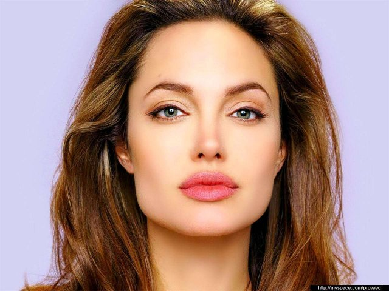 | 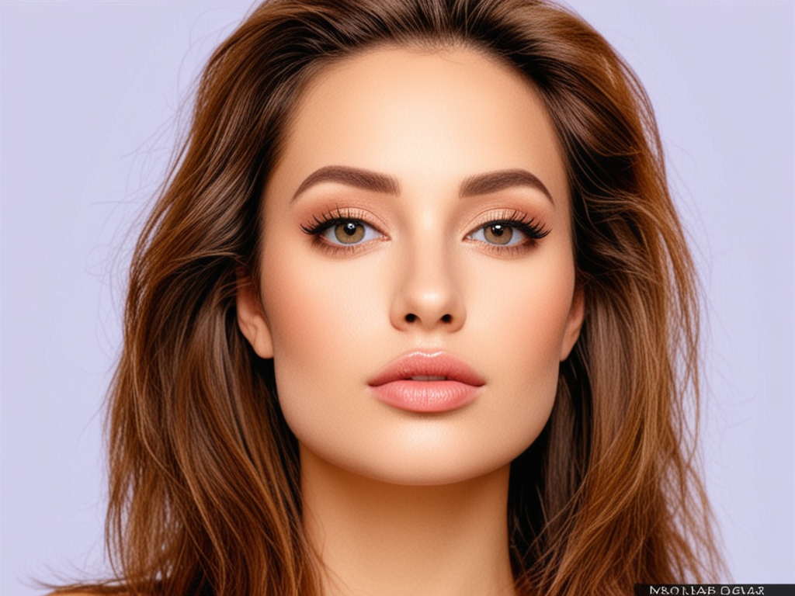 | 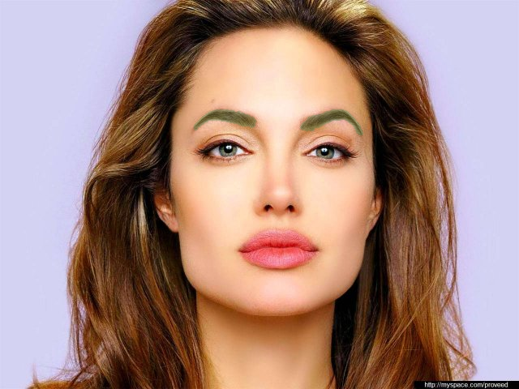 | 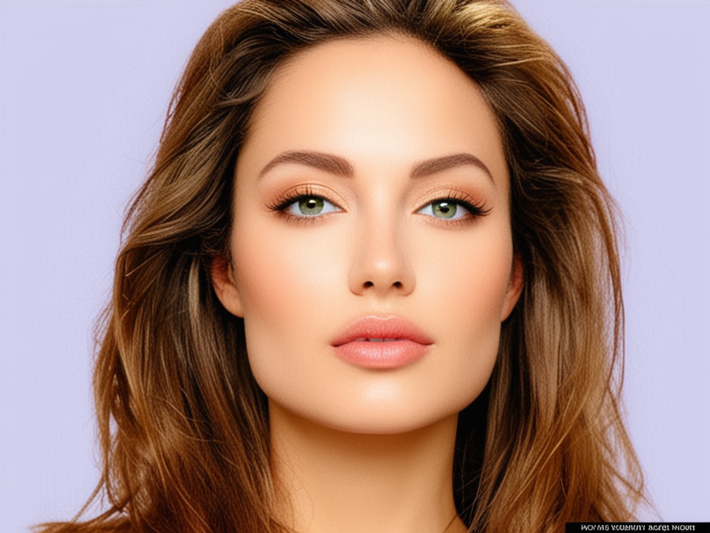 | 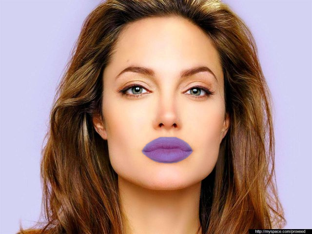 | 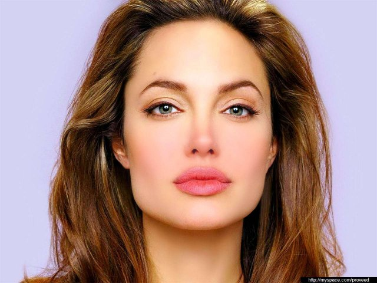 | 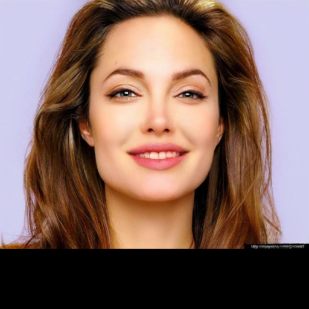 |

---

## 🔎 Visual examples — Remove Objects

| Input                                       | Auto Remove                                       | Manual Cleanup                                       |
| ------------------------------------------- | ------------------------------------------------- | ---------------------------------------------------- |
|  |  |  |

---

## 🔎 Visual examples — Skin Clean

| Input                                   | Output                                   |
| --------------------------------------- | ---------------------------------------- |
| 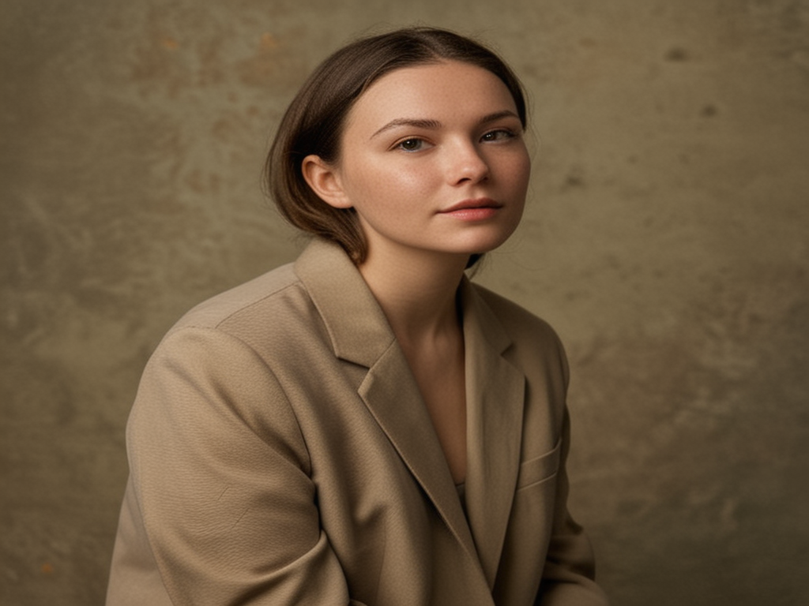 | 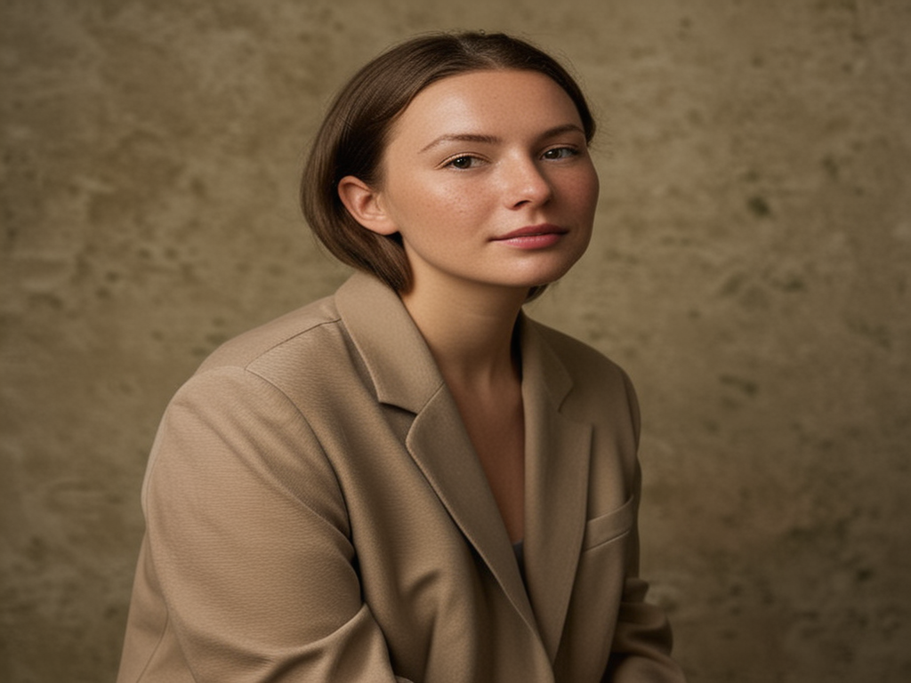 |

---

## 🔎 Visual examples — AI Enhancer / Upscale

| Input                                    | AI Enhancer 1                                    | AI Enhancer 2                                    | Upscale                                    |
| ---------------------------------------- | ------------------------------------------------ | ------------------------------------------------ | ------------------------------------------ |
|  |  |  |  |

---

## 🔎 Visual examples — Remove Background

| Input                                          | White Background                                          | Transparent                                          |
| ---------------------------------------------- | --------------------------------------------------------- | ---------------------------------------------------- |
|  |  |  |

---

## 🔎 Visual showcase

| Input                                 | Ghibli                                 | Remove Background                                 | Evening Glam 1                                 | Evening Glam 2                                 | Evening Glam 3                                 | Green Lips                                 | Green Eyes                                 | Black Eyes                                 | Red Lips                                 | Smile Level 3                                 |
| ------------------------------------- | -------------------------------------- | ------------------------------------------------- | ---------------------------------------------- | ---------------------------------------------- | ---------------------------------------------- | ------------------------------------------ | ------------------------------------------ | ------------------------------------------ | ---------------------------------------- | --------------------------------------------- |
|  | 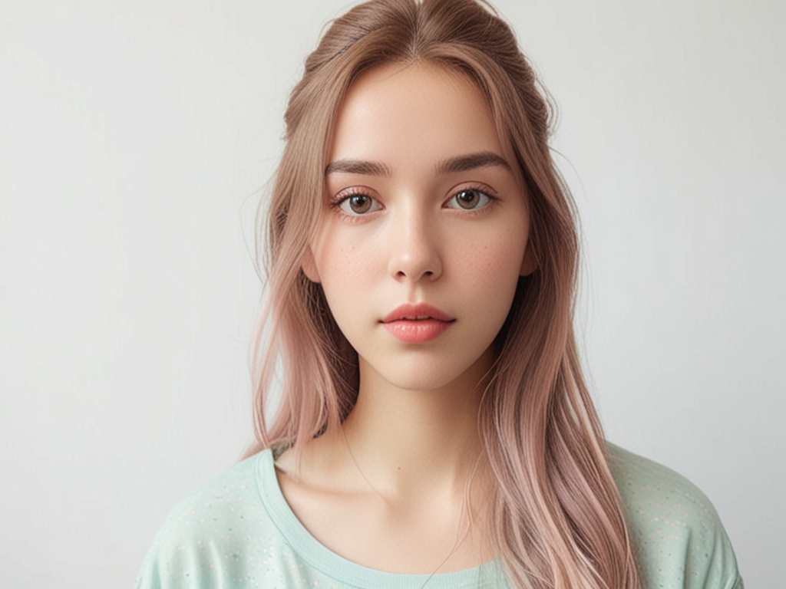 | 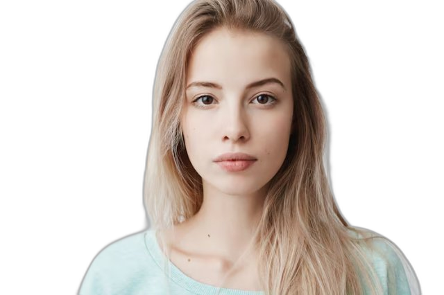 | 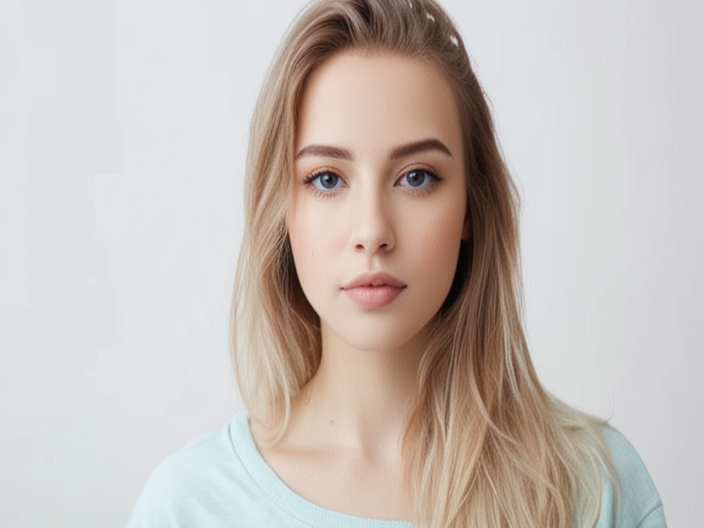 | 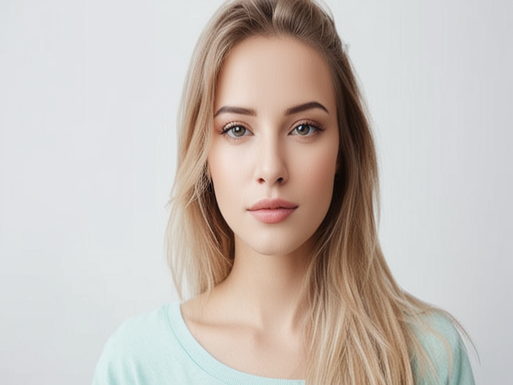 | 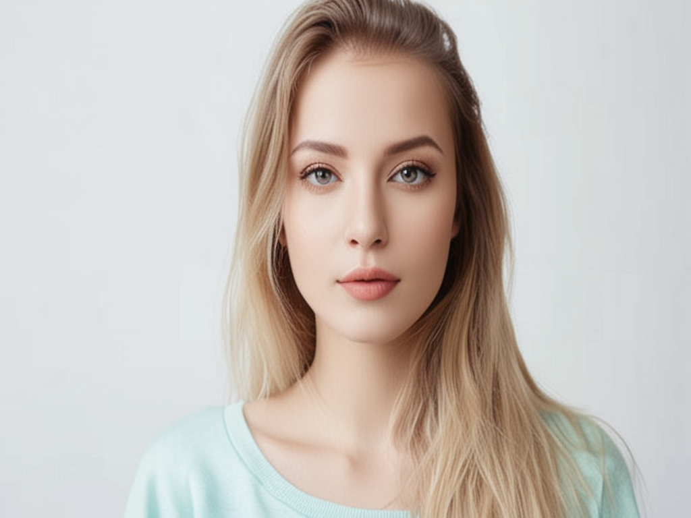 | 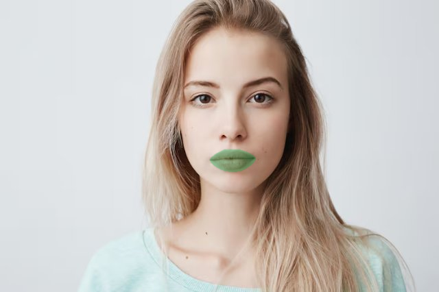 | 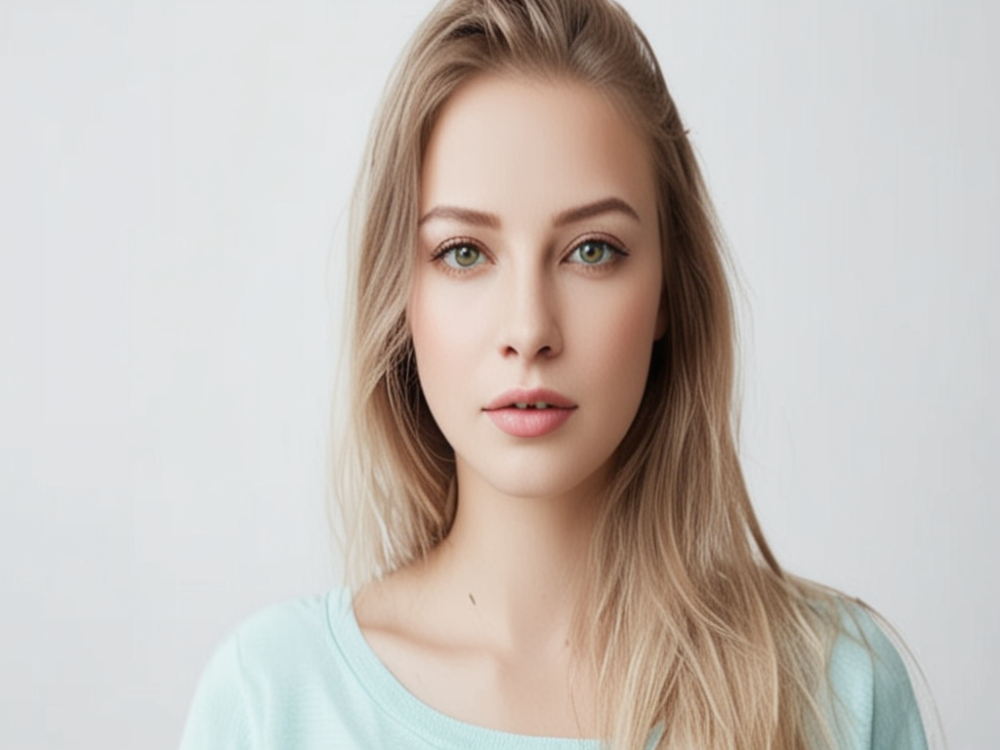 |  |  | 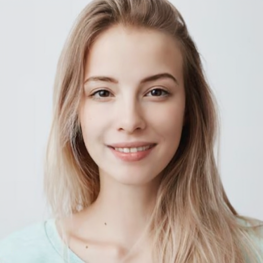 |

---

## 📦 Current git status summary

| Category                  | Files                                                                                                                                                                                                                                                                                                                             |
| ------------------------- | --------------------------------------------------------------------------------------------------------------------------------------------------------------------------------------------------------------------------------------------------------------------------------------------------------------------------------- |
| renamed scripts           | `scripts/background/remove_background.py`, `scripts/common/convert_image_to_png.py`, `scripts/generation/create_prompt_collage.py`, `scripts/objects/auto/create_object_mask_sam.py`, `scripts/objects/common/apply_inpaint_mask.py`, `scripts/objects/manual/prepare_manual_cleanup_mask.py`, `scripts/upscale/upscale_image.py` |
| unused scripts moved      | `scripts/unused/create_object_mask.py`, `scripts/unused/remove_objects.py`                                                                                                                                                                                                                                                        |
| modified runners          | `glam_makeup_runner`, `prompt_runner`, `remove_background_runner`, `remove_objects_*`, `template_runner`, `upscale_runner`                                                                                                                                                                                                        |
| modified face edit        | `face_edit_plan`, `face_masks`, `face_parser`, `face_regions`                                                                                                                                                                                                                                                                     |
| modified prompt           | `prompt_builder`                                                                                                                                                                                                                                                                                                                  |
| new folders               | `scripts/face/`, `models/mediapipe/`, `readme_assets/*`                                                                                                                                                                                                                                                                           |
| deleted old README assets | old `readme_assets/remove_objects_manual/*`                                                                                                                                                                                                                                                                                       |

---

## ⚠️ Important note about README assets

| Old folder                             | Current folders                                                     |
| -------------------------------------- | ------------------------------------------------------------------- |
| `readme_assets/remove_objects_manual/` | replaced by `readme_assets/remove_objects/`                         |
| old manual examples deleted            | new remove objects examples live in `readme_assets/remove_objects/` |

---

## ✅ Final result

| Capability                                | Status |
| ----------------------------------------- | ------ |
| modular action runners                    | ✅      |
| organized script folders                  | ✅      |
| local Glam Makeup pipeline                | ✅      |
| Qwen prompt translator                    | ✅      |
| MediaPipe face masks                      | ✅      |
| lips/cheeks/eyes/eyelids/eyebrows support | ✅      |
| Remove Objects auto/manual preserved      | ✅      |
| Remove Background preserved               | ✅      |
| Skin Clean examples                       | ✅      |
| AI Enhancer/Upscale examples              | ✅      |
| README visual showcase                    | ✅      |
| ComfyUI fallback for complex styles       | ✅      |

---

## 🧾 Commit checklist

```bash
cd ~/mobile-assets-backend

git add .
git status

git commit -m "Add prompt platform and local face editing pipeline"

git push -u origin feature/prompt-platform
```

---

## ⬅️ Назад

| Link        | URL                                                                    |
| ----------- | ---------------------------------------------------------------------- |
| Main README | https://github.com/amanzhola/mobile-assets-backend/blob/main/README.md |
