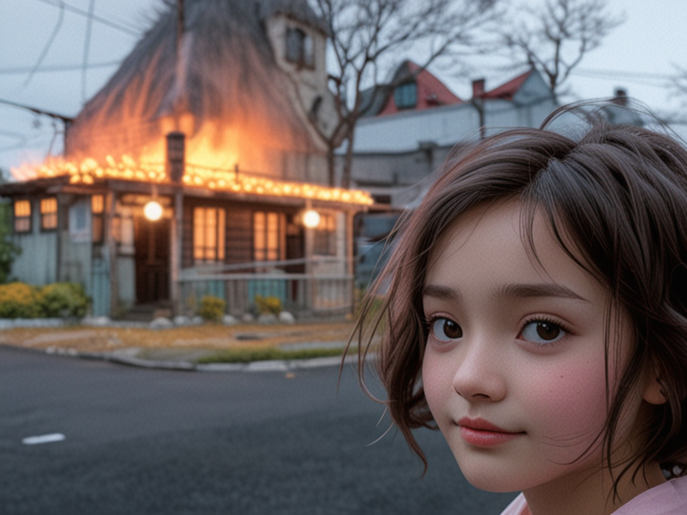

# 🖼️ feature/templates-sdxl-actions

| Branch                           | Parent                       | Stage               | Goal                                          | AI Enhancer | Tools        | Templates               | Remove Background   | Refactor                         | Android            | Back                                                                                  |
| -------------------------------- | ---------------------------- | ------------------- | --------------------------------------------- | ----------- | ------------ | ----------------------- | ------------------- | -------------------------------- | ------------------ | ------------------------------------------------------------------------------------- |
| `feature/templates-sdxl-actions` | `feature/tools-sdxl-actions` | real SDXL Templates | 24 Templates через real two-image composition | unchanged   | already SDXL | `template_img2img.json` | direct `rembg` path | partial `src/generation/*` split | No Android changes | [Main README](https://github.com/amanzhola/mobile-assets-backend/blob/main/README.md) |

---

## ✅ What was done

| #  | Area                   | Before                                                | After                                                                          | Result                              |
| -- | ---------------------- | ----------------------------------------------------- | ------------------------------------------------------------------------------ | ----------------------------------- |
| 1  | Template output        | returned original uploaded image / mock-copy behavior | returns generated `/outputs/...`                                               | Templates are no longer fake        |
| 2  | Template inputs        | one image was used incorrectly                        | user image + template background image                                         | correct two-image generation        |
| 3  | Template assets        | duplicated files risk                                 | existing Git-backed `TemplateAssetService` cache                               | no large duplicate template files   |
| 4  | User subject           | raw user image                                        | `subject_<task_id>_<image_index>.png` transparent PNG                          | person/object can be composited     |
| 5  | Template workflow      | weak/copy flow                                        | remove background → subject PNG → template background → composite → SDXL blend | real Template pipeline              |
| 6  | Mask direction         | black rectangle / invisible person                    | corrected alpha-mask direction                                                 | subject is visible                  |
| 7  | Remove Background      | SDXL img2img route                                    | direct `rembg` script                                                          | correct background removal behavior |
| 8  | Android option naming  | backend checked wrong option path in places           | backend reads actual Android option value                                      | white + transparent modes work      |
| 9  | Transparent mode       | could force white/black-looking output                | RGBA PNG with alpha                                                            | real transparency                   |
| 10 | White mode             | not stable                                            | subject composited on pure white                                               | clean white background              |
| 11 | Script                 | missing/stale                                         | `scripts/remove_background.py`                                                 | shared cutout helper                |
| 12 | Template workflow file | absent                                                | `workflows/template_img2img.json`                                              | separate workflow for Templates     |
| 13 | Refactor               | `generation_service.cpp` too large                    | partial split into `src/generation/*`                                          | responsibilities start separating   |
| 14 | Include paths          | broken after split                                    | relative includes fixed                                                        | build works                         |
| 15 | Existing flows         | risk of regression                                    | AI Enhancer, Remove Background, Template checked                               | stable current branch               |

---

## 🧱 Main architecture

| Flow                          | Input                                | Processing                                             | Output            |
| ----------------------------- | ------------------------------------ | ------------------------------------------------------ | ----------------- |
| AI Enhancer                   | uploaded user image                  | dedicated `workflows/ai_enhancer.json`                 | `/outputs/...`    |
| Tools                         | uploaded user image                  | shared `workflows/tool_img2img.json`                   | `/outputs/...`    |
| Templates                     | uploaded user image + template asset | transparent subject + template background + SDXL blend | `/outputs/...`    |
| Remove Background white       | uploaded user image                  | `rembg` + white background                             | `/outputs/...png` |
| Remove Background transparent | uploaded user image                  | `rembg` + RGBA alpha                                   | `/outputs/...png` |
| Prompt                        | 1–5 uploaded images                  | still mostly pass-through/simple return                | next stage        |

---

## 🔁 Template pipeline

| Step | Source  | Action                                 | Target                   |
| ---- | ------- | -------------------------------------- | ------------------------ |
| 1    | Android | sends template generation request      | backend `/generations`   |
| 2    | Backend | reads selected `templateId`            | template asset cache     |
| 3    | Backend | loads user image from `storage/input`  | local source image       |
| 4    | Backend | runs `scripts/remove_background.py`    | transparent subject PNG  |
| 5    | Backend | uploads subject PNG to ComfyUI         | `/upload/image`          |
| 6    | Backend | uploads/uses template background image | ComfyUI input            |
| 7    | ComfyUI | runs `template_img2img.json`           | composite + SDXL blend   |
| 8    | Backend | downloads result through `/view`       | `storage/output`         |
| 9    | Android | polls task result                      | `/outputs/...` image URL |

---

## 🧩 Template workflow

| Workflow file                     | Why separate                           | Uses                                      |
| --------------------------------- | -------------------------------------- | ----------------------------------------- |
| `workflows/template_img2img.json` | Templates require two image inputs     | transparent subject + template background |
| `workflows/ai_enhancer.json`      | AI Enhancer has its own enhancer logic | not changed                               |
| `workflows/tool_img2img.json`     | Tools share one SDXL img2img route     | not changed                               |

---

## 🧼 Remove background modes

| Mode             | Backend behavior                   | Output                         |
| ---------------- | ---------------------------------- | ------------------------------ |
| `transparent`    | `rembg` cutout saved directly      | RGBA PNG with alpha            |
| `white`          | `rembg` cutout composited on white | PNG/RGB-style white background |
| default/fallback | white unless transparent requested | safe visible result            |

---

## 📂 New / changed files

| File                                              | Purpose                               |
| ------------------------------------------------- | ------------------------------------- |
| `workflows/template_img2img.json`                 | Template-specific ComfyUI workflow    |
| `scripts/remove_background.py`                    | local `rembg + Pillow` helper         |
| `src/generation/generation_json.h`                | JSON helper declarations              |
| `src/generation/generation_json.cpp`              | JSON helper implementation            |
| `src/generation/generation_tool_prompts.h`        | tool prompt declarations              |
| `src/generation/generation_tool_prompts.cpp`      | tool prompt implementation            |
| `src/generation/generation_task_store.h`          | task store declarations               |
| `src/generation/generation_task_store.cpp`        | task store implementation             |
| `src/generation/generation_template_workflow.h`   | template workflow declarations        |
| `src/generation/generation_template_workflow.cpp` | template workflow implementation      |
| `src/generation_service.cpp`                      | reduced but still large orchestration |
| `src/generation_service.h`                        | updated declarations                  |
| `src/comfy/workflow_builder.cpp`                  | template workflow support             |
| `src/comfy/workflow_builder.h`                    | template workflow API                 |

---

## 🔧 Include path fix after refactor

| From files inside  | Correct relative include      |
| ------------------ | ----------------------------- |
| `src/generation/*` | `../comfy/comfy_client.h`     |
| `src/generation/*` | `../comfy/workflow_builder.h` |
| `src/generation/*` | `../template_asset_service.h` |

---

## ✅ Checked flows

| Flow                          | Expected                                        | Status    |
| ----------------------------- | ----------------------------------------------- | --------- |
| AI Enhancer                   | still uses dedicated enhancer workflow          | ✅ checked |
| Remove Background white       | white background result                         | ✅ checked |
| Remove Background transparent | PNG alpha result                                | ✅ checked |
| Template `travel_style`       | template background + user subject + SDXL blend | ✅ checked |

---

## ⚠️ Known limitations

| Limitation               | Current state                 | Future fix                                      |
| ------------------------ | ----------------------------- | ----------------------------------------------- |
| Template quality         | real but basic                | advanced template metadata + better workflows   |
| Identity preservation    | not guaranteed                | IPAdapter / ControlNet / face identity workflow |
| Pose transfer            | not implemented               | ControlNet pose/depth/openpose                  |
| Subject placement        | fixed coordinates in workflow | template-specific metadata                      |
| Subject size             | fixed workflow sizing         | `subject x/y/width/height/crop mode`            |
| Hair/edge quality        | depends on `rembg`            | better segmentation model                       |
| `generation_service.cpp` | still large                   | more runners/services split                     |
| Prompt generation        | not real SDXL composition yet | next branch                                     |

---

## 🧭 Remaining refactor targets

| Future component                      | Purpose                                            |
| ------------------------------------- | -------------------------------------------------- |
| `generation_comfy_runner`             | isolate ComfyUI execution                          |
| `generation_remove_background_runner` | isolate `rembg` flow                               |
| `generation_prompt_runner`            | isolate Prompt generation                          |
| `generation_template_metadata`        | store per-template placement and sizing            |
| `generation_queue_worker`             | real queued worker instead of direct orchestration |

---

# 🖼️ Example Results

| Feature                         | Example Image                                                  | Description                                              |
| ------------------------------- | -------------------------------------------------------------- | -------------------------------------------------------- |
| Remove Background (white)       |        | Subject composited onto pure white background            |
| Remove Background (transparent) |  | PNG with alpha channel generated by `rembg`              |
| Template Generation             |          | User subject blended into template background using SDXL |
| Ghibli Tool                     |                 | Shared SDXL tool workflow example                        |
| Smile Edit                      |             | Natural smile modification result                        |

---

# 📸 Verified Outputs

| Action                        | Output file pattern            | Status |
| ----------------------------- | ------------------------------ | ------ |
| Remove Background White       | `pixo_remove_background_*.png` | ✅      |
| Remove Background Transparent | `pixo_remove_background_*.png` | ✅      |
| Template                      | `pixo_template_*.png`          | ✅      |
| Ghibli                        | `pixo_ghibli_*.png`            | ✅      |
| Smile Edit                    | `pixo_smile_edit_*.png`        | ✅      |

---

# 🎨 Current visual quality

| Pipeline              | Image source            | Status |
| --------------------- | ----------------------- | ------ |
| AI Enhancer           | dedicated workflow      | ✅      |
| Tools                 | `tool_img2img.json`     | ✅      |
| Templates             | `template_img2img.json` | ✅      |
| Remove Background     | `rembg`                 | ✅      |
| Android Result Screen | `/outputs/...`          | ✅      |

---

## 🔜 Next stage

| Branch                            | Goal                                 |
| --------------------------------- | ------------------------------------ |
| `feature/prompt-sdxl-composition` | implement Prompt generation properly |
| `feature/prompt-sdxl-multi-image` | alternative name for same next stage |

---

## 🎯 Prompt target behavior

| Prompt case     | Current                           | Target                                   |
| --------------- | --------------------------------- | ---------------------------------------- |
| 1 image         | mostly pass-through/simple return | SDXL img2img with user prompt            |
| 2 images        | mostly pass-through/simple return | collage/contact sheet/composition input  |
| 3–5 images      | mostly pass-through/simple return | multi-image composition input            |
| positive prompt | partially used                    | user prompt becomes SDXL positive prompt |
| result          | may not be real composition       | generated `/outputs/...` URL             |

---

## 🧾 Recommended next branch

| Step               | Command                                           |
| ------------------ | ------------------------------------------------- |
| create next branch | `git checkout -b feature/prompt-sdxl-composition` |

---

## 🏁 Final state

| Capability                                        | Status |
| ------------------------------------------------- | ------ |
| Templates no longer return original upload        | ✅      |
| Templates use user image + template image         | ✅      |
| Template assets come from existing asset pipeline | ✅      |
| Transparent subject PNG generated                 | ✅      |
| Template workflow uses two images                 | ✅      |
| Remove Background fixed with direct `rembg`       | ✅      |
| Transparent mode outputs alpha PNG                | ✅      |
| White mode outputs white background               | ✅      |
| Partial generation refactor done                  | ✅      |
| AI Enhancer preserved                             | ✅      |
| Tools preserved                                   | ✅      |
| Prompt remains next major block                   | ⏭️     |

---

## ⬅️ Назад

| Link        | URL                                                                    |
| ----------- | ---------------------------------------------------------------------- |
| Main README | https://github.com/amanzhola/mobile-assets-backend/blob/main/README.md |
